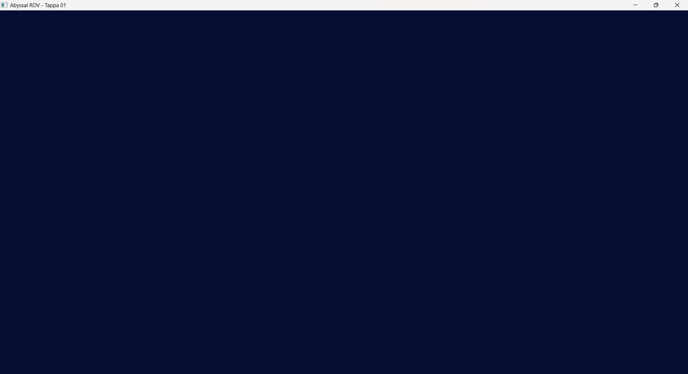

# Tappa 01: Setup Iniziale

## Obiettivo della Tappa e Motivazioni
L'obiettivo di questa primissima fase è stato stabilire l'infrastruttura fondamentale del motore grafico. Configurare l'ambiente di sviluppo in C++ con CMake: senza un corretto collegamento tra le librerie (SFML per la gestione della finestra e degli eventi, GLAD per caricare i puntatori alle funzioni di OpenGL moderne, e GLM per la matematica vettoriale), è impossibile avviare la simulazione 3D. 
Ho quindi inizializzato una finestra SFML 3.0 con un contesto OpenGL 4.1 Core e implementato il *game loop* primario. Per ora, il ciclo si limita a pulire i buffer di colore e di profondità (impostando uno sfondo di colore blu oceanico) al fine di confermare la corretta comunicazione tra CPU e GPU.

## Istruzioni di Build
Per configurare e compilare questa tappa utilizzando CMake e MinGW:
1. Aprire il terminale nella cartella radice del progetto.
2. Assicurarsi di aver pulito eventuali configurazioni precedenti eliminando la cartella `build` e il file `CMakeCache.txt`.
3. Configurare il progetto indicando il generatore corretto:
   `cmake -S . -B build -G "MinGW Makefiles"`
4. Compilare l'eseguibile:
   `cmake --build build`
5. Avviare l'applicazione eseguendo il file generato (es. `./build/Tappa01.exe`).

## Problematiche Affrontate e Soluzioni
La fase di setup della *toolchain* C++ su ambiente Windows ha presentato alcune insidie ambientali e di configurazione.

* **Problema 1:**
    Durante la prima configurazione, CMake non riusciva a scaricare SFML e GLM tramite il comando `FetchContent`, interrompendo la generazione.
    * **Soluzione:** È stato necessario installare Git sul sistema operativo e, successivamente, aggiungere manualmente il percorso dell'eseguibile alle variabili d'ambiente `PATH` di Windows per renderlo visibile al comando CMake.
* **Problema 2:**
    Errore `CMAKE_MAKE_PROGRAM is not set`. CMake configurava l'ambiente ma non trovava il linker materiale per eseguire la build.
    * **Soluzione:** È stato necessario aprire il terminale di MSYS2 e installare esplicitamente il pacchetto `make` per l'ambiente `ucrt64`.
* **Problema 3:**
    Durante la generazione, CMake restituiva l'errore `Missing variable is: CMAKE_C_COMPILE_OBJECT`.
    Il template `CMakeLists.txt` di partenza forzava l'uso esclusivo del C++ tramite l'istruzione `project(NomeProgetto LANGUAGES CXX)`. Tuttavia, la libreria GLAD necessita della compilazione del file `glad.c` (scritto in C puro).
    * **Soluzione:** È stata rimossa la restrizione `LANGUAGES CXX` dal comando `project()`, permettendo a CMake di attivare e utilizzare automaticamente sia il compilatore C che C++.

Oltre ai problemi di toolchain, cito alcune scelte architetturali preventive per evitare crash o bug grafici nelle tappe successive:

* **Fallback a OpenGL Legacy:** Di default, se non specificato, il sistema operativo potrebbe assegnare un contesto OpenGL "Compatibility". Questo avrebbe ostacolato l'apprendimento della pipeline moderna.
    * **Soluzione:** Ho forzato esplicitamente il profilo moderno tramite `settings.attributeFlags = sf::ContextSettings::Core;` e la versione `4.1`, garantendo che l'engine utilizzi rigorosamente VBO, VAO e Shader personalizzati.
* **Assenza di Profondità (Z-Fighting e Occlusione errata):** Se si fosse creata la finestra di default, OpenGL non avrebbe allocato memoria per la profondità dei pixel, rendendo impossibile gestire le sovrapposizioni 3D.
    * **Soluzione:** È stata forzata l'allocazione del buffer di profondità al momento della creazione della finestra tramite `settings.depthBits = 24;`.
* **Instabilità del Game Loop:** Un loop `while(window.isOpen())` libero gira al massimo delle capacità della GPU, causando picchi hardware al 100%, screen-tearing e calcoli della fisica sfasati.
    * **Soluzione:** Ho inserito un limite hardware di sicurezza tramite `window.setFramerateLimit(60);`, garantendo un ciclo stabile e prevedibile.

## Screenshot della Tappa
