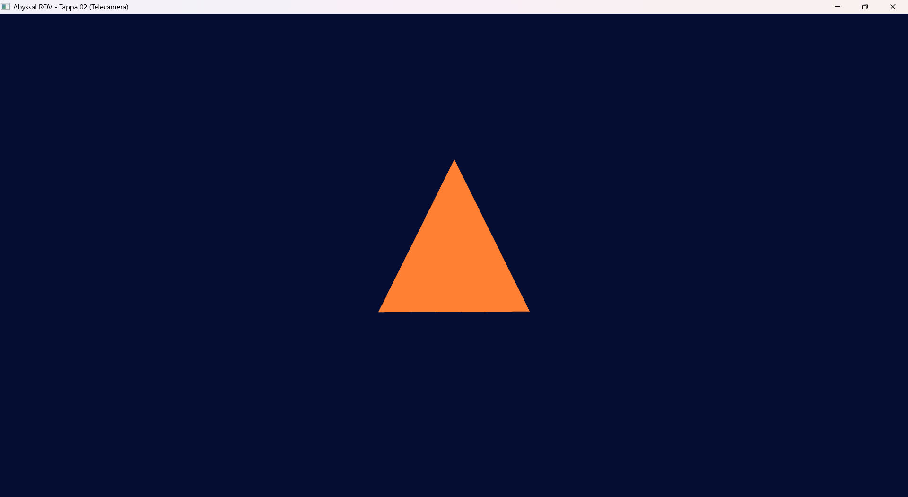
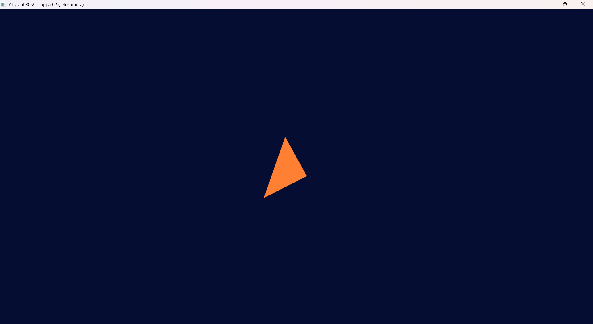

# Tappa 02: Telecamera Virtuale

## Obiettivo della Tappa e Motivazioni
L'obiettivo di questa tappa è stato il passaggio dalla gestione di una finestra vuota all'esplorazione attiva di uno spazio 3D. Per simulare la visuale di un sottomarino (ROV), è stata implementata una classe dedicata (`Camera`) che incapsula la matematica della *View Matrix*. 
La telecamera possiede 6 gradi di libertà (movimento sugli assi X, Y, Z e rotazione tramite angoli di Eulero). Per poter verificare l'effettivo funzionamento delle matrici di trasformazione (Model, View, Projection) e avere un riferimento spaziale in un ambiente per ora privo di fondale, ho configurato il primo Vertex Array Object (VAO) per renderizzare un singolo triangolo colorato al centro dello spazio cartesiano.
In questa fase è stata inoltre integrata la gestione dell'input tramite il tasto `TAB` come interruttore di sicurezza: il comando consente di sbloccare istantaneamente il cursore del mouse e disabilitare l'aggiornamento della telecamera, permettendo all'utente di interagire liberamente con la finestra senza alterare l'orientamento spaziale del sottomarino.

## Istruzioni di Build
La compilazione segue lo standard definito nella Tappa 01, con l'aggiunta dei nuovi file sorgente al target di CMake:
1. Assicurarsi che i file `Camera.h` e `Camera.cpp` siano presenti nella directory `Cartella-Tappa02`.
2. Aprire il terminale nella radice del progetto e configurare:
   `cmake -S . -B build -G "MinGW Makefiles"`
3. Compilare il progetto:
   `cmake --build build`
4. Eseguire l'applicazione (es. `./build/Tappa02.exe`).

## Comandi del Giocatore
L'interazione con l'ambiente 3D avviene tramite tastiera e mouse, simulando il controllo dei propulsori e delle telecamere del ROV:
* **W / S:** Movimento in avanti / indietro lungo il vettore direzionale (*Front*).
* **A / D:** Movimento laterale a sinistra / destra (*Right*).
* **Spazio / Shift Sinistro:** Traslazione verticale assoluta verso l'alto / basso sull'asse globale (*WorldUp*).
* **Movimento Mouse:** Rotazione della visuale (Pitch e Yaw).
* **TAB:** Sblocco del mouse. Il cursore viene liberato e la telecamera viene messa in "pausa", permettendo di uscire dai confini della finestra per ridimensionarla o chiuderla tramite OS.
* **Uscita Rapida:** È possibile chiudere istantaneamente la simulazione premendo `ESC` o `Alt+F4`.

## Problematiche Affrontate e Soluzioni
Rispetto alla tappa01 qui ho avuto meno preblemi, legati a matematica e interfaccia con il sistema operativo.

* **Problema 1:** Quando la finestra di SFML veniva ingrandita o messa a schermo intero, l'area di rendering di OpenGL (Viewport) rimaneva bloccata a 800x600 nell'angolo in basso a sinistra. Inoltre, le coordinate del centro dello schermo, usate per bloccare il mouse, diventavano scorrette, causando rotazioni erratiche.
    * **Soluzione:** Ho aggiunto la gestione dell'evento `sf::Event::Resized`. Al ridimensionamento, viene richiamata `glViewport` con le nuove dimensioni e viene ricalcolato dinamicamente il punto centrale dello schermo su cui ancorare il mouse.
* **Problema 2:** Muovendo il mouse per guardare completamente in alto o in basso (angolo di *Pitch* a 90 o -90 gradi), il vettore *Up* della telecamera si capovolgeva, causando il ribaltamento totale dell'immagine.
    * **Soluzione:** Ho implementato un blocco matematico nella classe `Camera` che impedisce al *Pitch* di superare gli 89.0 e i -89.0 gradi, preservando l'orientamento corretto.
* **Problema 3:** Durante i primi test, la velocità del sottomarino variava drasticamente in base alle prestazioni del PC (più FPS corrispondevano a una velocità maggiore).
    * **Soluzione:** calcolo del `deltaTime` (il tempo trascorso tra un frame e l'altro). Moltiplicando la velocità di movimento per il `deltaTime`, la navigazione è diventata basata sul tempo reale e indipendente dall'hardware.

## Screenshot della Tappa

