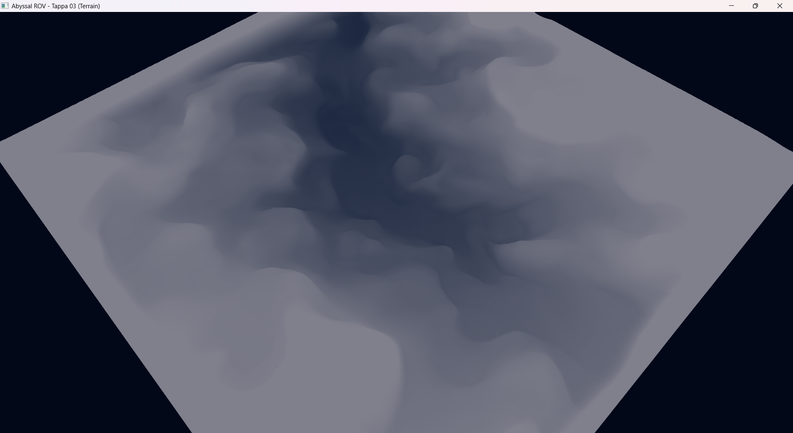

# Tappa 03: Generazione del Terrain (Heightmap)

## Obiettivo della Tappa e Motivazioni
L'obiettivo di questa fase è la costruzione di un fondale oceanico credibile e navigabile. Invece di caricare un modello 3D statico pre-modellato per il pavimento, ho implementato una tecnica di Generazione Procedurale basata su *Heightmap* (una mappa delle altezze in scala di grigi). 
Questo approccio ha richiesto la creazione dinamica di una mesh 3D strutturata a griglia, in cui ogni pixel dell'immagine definisce l'altitudine (asse Y) di un vertice. Oltre alle coordinate spaziali, l'algoritmo calcola dinamicamente le normali per ogni vertice (fondamentali per le future implementazioni dell'illuminazione) e passa i dati alla GPU tramite *Element Buffer Object (EBO)* per un rendering efficiente tramite indici.
In questa fase, il *Fragment Shader* mappa temporaneamente l'altezza dei vertici su una scala cromatica (dal blu del fondale all'azzurro chiaro delle vette) per validare visivamente le pendenze.

## Istruzioni di Build
1. Assicurarsi di aver inserito l'immagine `heightmap.png` all'interno della directory condivisa `Cartella-risorse/`.
2. Aggiungere l'eseguibile della Tappa 03 al file `CMakeLists.txt` principale.
3. Aprire il terminale e compilare il progetto: `cmake --build build`
4. Eseguire l'applicazione (es. `./build/Tappa03.exe`).

## Comandi del Giocatore
* **W / S:** Avanza / Indietreggia.
* **A / D:** Traslazione laterale (Sinistra / Destra).
* **Spazio / Shift Sinistro:** Traslazione verticale globale (Emersione / Immersione).
* **Mouse:** Rotazione della telecamera virtuale a 360 gradi.
* **ESC:** Chiusura dell'applicazione.
* **TAB:** Sblocco del mouse. Il cursore viene liberato e la telecamera viene messa in "pausa", permettendo di uscire dai confini della finestra per ridimensionarla o chiuderla tramite OS.

## Problematiche Affrontate e Soluzioni
La creazione procedurale di una topografia a griglia ha introdotto le seguenti problematiche:

* **Problema 1:** Le heightmap reperibili online generavano terreni irregolari o aperti ai bordi, rendendo complesso limitare il giocatore in un'area definita che rendesse l'idea di una fossa oceanica.
    * **Soluzione:** La mappa delle altezze (512x512) è stata disegnata manualmente da zero utilizzando l'editor grafico online gratuito **Photopea**. Ho sfruttato il touchscreen del mio laptop e un pennino, impostato uno sfondo nero (profondità massima) e, utilizzando un pennello bianco a durezza zero e bassa opacità, ho colorato i bordi della mappa per generare muri naturali e pendenze morbide.
* **Problema:** Una mappatura 1:1 tra pixel dell'immagine e unità di OpenGL generava un mondo microscopico con picchi verticali irrealistici.
    * **Soluzione:** Ho introdotto parametri di scalatura indipendenti. Variando iterativamente i valori, si è raggiunto l'equilibrio ottimale con `scaleXZ = 0.5f` (per espandere la topografia in orizzontale) e `scaleY = 25.0f` (per limitare l'altezza massima dei dislivelli).
* **Problema 3:** Il metodo `getPixel()` di SFML restituisce valori interi tra 0 e 255 per il colore. Passare questi valori diretti alla coordinata Y della mesh causava overflow e artefatti grafici enormi.
    * **Soluzione:** Il valore del colore del pixel è stato castato a `float` e normalizzato dividendolo per `255.0f`, riportando l'altezza a un range controllabile [0.0, 1.0] prima di moltiplicarlo per lo `scaleY`.
* **Problema 4:** Costruire triangoli validi unendo i punti della griglia richiedeva di definire gli indici in un ordine antiorario (*counter-clockwise*), pena il culling delle facce o la creazione di geometrie incrociate.
    * **Soluzione:** Ho implementato un doppio ciclo for che, per ogni cella della griglia `(x, z)`, genera esattamente due triangoli individuando gli indici tramite l'equazione per array monodimensionali: `row * width + col`. Questo ha garantito una *topology* perfetta senza spreco di vertici.

* **Crediti Strumenti:** L'immagine della heightmap è stata realizzata utilizzando l'editor grafico online gratuito **Photopea** (www.photopea.com).

## Screenshot della Tappa

