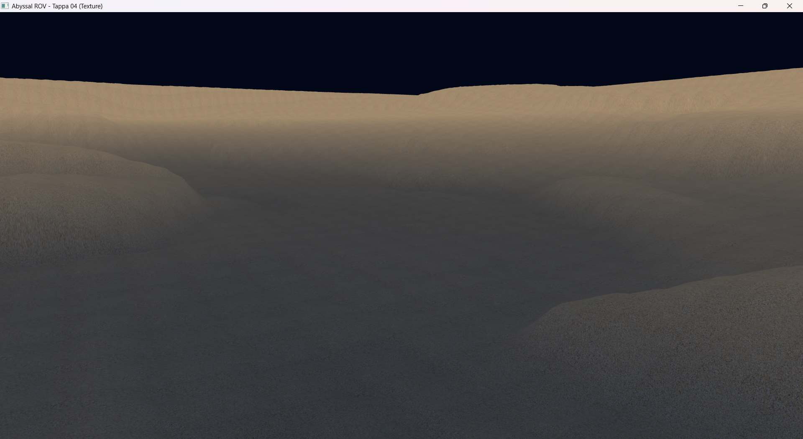

# Tappa 04: Materiali e Texture

## Obiettivo della Tappa e Motivazioni
L'obiettivo di questa fase è incrementare il realismo visivo del fondale procedurale, passando da una colorazione basata esclusivamente sull'altezza a un vero e proprio *Texture Mapping*. 
È stata introdotta la gestione delle Coordinate UV per mappare un'immagine bidimensionale (una fotografia di sabbia oceanica) sui vertici 3D della *heightmap*. Il *Fragment Shader* è stato aggiornato per fondere due concetti: campiona il colore dalla texture caricata in memoria GPU tramite un `sampler2D`, e contestualmente lo moltiplica per il gradiente di profondità introdotto nella tappa precedente. Il risultato è una texture definita e chiara sulle vette dei dislivelli, che sfuma in un blu scuro e torbido nelle fosse oceaniche.

* **Crediti Risorse:** La texture *seamless* (senza cuciture) della sabbia oceanica utilizzata per il fondale è stata reperita gratuitamente dal database **ManyTextures** (https://www.manytextures.com/).

## Istruzioni di Build
1. Inserire l'immagine della texture (es. `sand.png`) nella directory condivisa `Cartella-risorse/`.
2. Aggiungere il target `Tappa04` al file `CMakeLists.txt` principale.
3. Compilare il progetto da terminale o tramite l'estensione CMake Tools di VS Code: `cmake --build build`.
4. Avviare l'eseguibile risultante.

## Comandi del Giocatore
* **W / S:** Avanza / Indietreggia.
* **A / D:** Traslazione laterale.
* **Spazio / Shift Sinistro:** Emersione / Immersione.
* **Mouse:** Rotazione della telecamera virtuale a 360 gradi.
* **ESC:** Uscita.
* **TAB:** Sblocco del mouse. Il cursore viene liberato e la telecamera viene messa in "pausa", permettendo di uscire dai confini della finestra per ridimensionarla o chiuderla tramite OS.

## Problematiche Affrontate e Soluzioni
L'applicazione di materiali fotografici su una geometria generata proceduralmente ha richiesto diverse ottimizzazioni per la gestione della memoria (VRAM) e per la resa visiva.

* **Problema 1:** Le GPU moderne sono ottimizzate per mappare in memoria immagini le cui dimensioni siano potenze di 2 (es. 512x512, 1024x1024). L'uso di risoluzioni arbitrarie avrebbe causato colli di bottiglia o distorsioni. Inoltre, essendo l'immagine ripetuta su una griglia enorme, una texture con elementi distintivi (conchiglie, sassi) avrebbe palesato l'effetto "scacchiera" (Tiling). Una risoluzione 4K avrebbe inutilmente saturato centinaia di megabyte di VRAM per un dettaglio impercettibile nel buio.
    * **Soluzione:** Ho scelto una texture da 1024x1024 pixel, *seamless* (per combaciare ai bordi) e visivamente neutra, per garantire il miglior compromesso tra ottimizzazione hardware e resa estetica.
* **Problema 2:** Durante i primi test, le coordinate UV venivano calcolate spalmando l'intera texture su ampie porzioni di mappa, rendendo i pixel giganti e sfocati. Inoltre, la proiezione planare delle coordinate UV (calcolate solo in base agli assi orizzontali X e Z) generava un forte stiramento (*stretching*) sulle pareti verticali dei dirupi.
    * **Soluzione:** Ho introdotto una variabile moltiplicatrice `textureTiling`. Aumentando questo valore a `100.0f`, si comunica a OpenGL di ripetere l'immagine 100 volte sulla mappa, aumentando drasticamente i texel per metro quadrato e mascherando efficacemente lo stiramento sulle scogliere.
* **Problema 3:** Poiché le coordinate UV generate superano abbondantemente il range standard [0.0, 1.0] (arrivando fino a 100.0 a causa del Tiling), i bordi della texture venivano trascinati all'infinito dal comportamento di default di OpenGL (`GL_CLAMP_TO_EDGE`).
    * **Soluzione:** Durante il caricamento della texture nella memoria GPU, ho settato esplicitamente i parametri `GL_TEXTURE_WRAP_S` e `GL_TEXTURE_WRAP_T` sul valore `GL_REPEAT`.
* **Problema 4:** Un *Tiling* così elevato causava un forte "sfarfallio" visivo dei pixel (*aliasing*) quando il fondale veniva osservato in lontananza o ad angolazioni radenti, poiché troppi texel cercavano di essere compressi in un singolo pixel dello schermo.
    * **Soluzione:** Ho generato il *Mipmap* della texture tramite `glGenerateMipmap`. Impostando il filtro di minificazione su `GL_LINEAR_MIPMAP_LINEAR`, la GPU passa automaticamente a versioni a risoluzione ridotta della texture per i poligoni più distanti, eliminando il rumore visivo.

## Screenshot della Tappa
