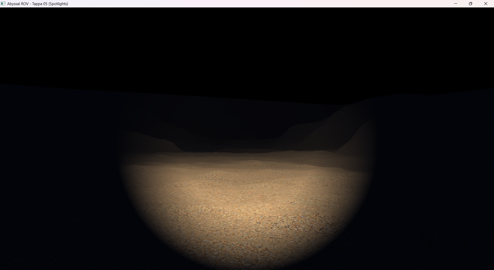

# Tappa 05: Illuminazione Dinamica (Spotlights)

## Obiettivo della Tappa e Motivazioni
Questa tappa segna l'introduzione di un modello di illuminazione fisicamente basato (seppur stilizzato), abbandonando la colorazione fittizia legata all'altezza della mesh. L'obiettivo è implementare un faro direzionale a cono (*Spotlight*) montato sul ROV, per illuminare selettivamente l'ambiente scuro.
Il calcolo della luce avviene interamente nel *Fragment Shader* (Per-Pixel Lighting). Per ogni frammento (pixel), vengono calcolati:
1. **Il Vettore di Direzione:** La differenza tra la posizione del frammento e la sorgente di luce.
2. **Il Cono di Luce (Cutoff):** Calcolato tramite il prodotto scalare (*Dot Product*) tra la direzione del frammento e la direzione assoluta del faro. Per evitare bordi taglienti e irrealistici, viene sfruttata un'interpolazione lineare (tramite `clamp`) tra un angolo interno continuo (*Inner Cutoff*) e uno esterno sfumato (*Outer Cutoff*).
3. **L'Attenuazione:** La dispersione della luce nell'acqua è calcolata tramite la funzione inversa della distanza quadratica: $I = \frac{1}{K_c + K_l \cdot d + K_q \cdot d^2}$.

## Istruzioni di Build
1. Aggiungere il target `Tappa05` al file `CMakeLists.txt` (sorgenti: `main.cpp` e `glad.c` presenti nella cartella).
2. Compilare il progetto da terminale o tramite l'estensione CMake Tools di VS Code: `cmake --build build`.
3. Avviare l'eseguibile risultante (es. `./build/Tappa05.exe`).

## Comandi del Giocatore
* **W / S:** Avanza / Indietreggia.
* **A / D:** Traslazione laterale.
* **Spazio / Shift Sinistro:** Emersione / Immersione.
* **Mouse:** Rotazione della telecamera a 360 gradi (Il faro seguirà la visuale).
* **ESC:** Uscita.
* **TAB:** Sblocco del mouse. Il cursore viene liberato e la telecamera viene messa in "pausa", permettendo di uscire dai confini della finestra per ridimensionarla o chiuderla tramite OS.

## Problematiche Affrontate e Soluzioni

* **Problema 1:** Fino alla successiva integrazione del modello del sottomarino, sorgeva il problema di dove ancorare le matrici di illuminazione nello spazio. 
    * **Soluzione:** Ho sfruttato un'astrazione architetturale in cui "la Telecamera è il sottomarino". I vettori `lightPos` e `lightDir` inviati allo shader tramite *Uniforms* corrispondono dinamicamente a `camera.Position` e `camera.Front`, montando idealmente la sorgente luminosa esattamente sul punto di vista dell'utente.
* **Problema 2:** Sollevando la telecamera verso l'alto (verso il vuoto dell'acqua), il fascio di luce scompare del tutto, restituendo un nero totale. Questo accade perché il *Fragment Shader* viene eseguito solo quando si interseca un poligono (la mesh della sabbia); in assenza di geometria o *raymarching* per simulare il pulviscolo volumetrico, la luce non ha superfici su cui riflettere.
    * **Soluzione:** Come scelta di Game Design, questo effetto "buio opprimente" risulta in realtà perfetto per l'atmosfera del fondale. Il problema del buio totale ai margini dello schermo verrà comunque mitigato nella Tappa 06 tramite l'introduzione di una *Nebbia Volumetrica* basata sul Depth Buffer.
* **Problema 3:** Un fascio troppo stretto o potente bruciava le texture della sabbia se osservate da vicino, distruggendo il dettaglio (*Color Clipping* oltre il valore 1.0), mentre un'attenuazione errata non permetteva di vedere il fondale.
    * **Soluzione:** il colore emesso è stato portato a `vec3(1.5, 1.4, 1.2)` per una luce più calda. L'attenuazione è stata smorzata con parametri morbidi ($K_l = 0.045$, $K_q = 0.003$). Per la sfumatura dei bordi, sono stati impostati un cut-off interno di $12^\circ$ e uno esterno di $22^\circ$.
* **Problema 4:** Calcolare l'arco-coseno (`acos`) nel Fragment Shader per milioni di pixel al secondo, al fine di determinare se un frammento rientri nel cono di luce, è un'operazione estremamente costosa.
    * **Soluzione:** Invece di inviare gli angoli in gradi e far calcolare il coseno alla GPU, eseguo il calcolo sulla CPU in C++ (`glm::cos(glm::radians(angle))`) passandolo già pre-calcolato alla variabile uniform. In questo modo lo shader si limita a confrontare questo valore con il prodotto scalare (`dot`) tra i vettori luminosi, un'operazione hardware nativa e velocissima.

## Utilizzo IA
L'implementazione del modello di illuminazione base (Lambert/Phong) è stata scritta seguendo i concetti teorici del corso. Tuttavia, strumenti di Intelligenza Artificiale Generativa (LLM) sono stati impiegati in fase di *pair-programming* per le implementazioni matematiche più avanzate: nello specifico, la stesura dell'interpolazione fluida per l'attenuazione dei bordi del faro sottomarino (Spotlight soft-edges) tramite l'utilizzo delle funzioni `clamp` ed `epsilon` all'interno del Fragment Shader.

## Screenshot della Tappa
