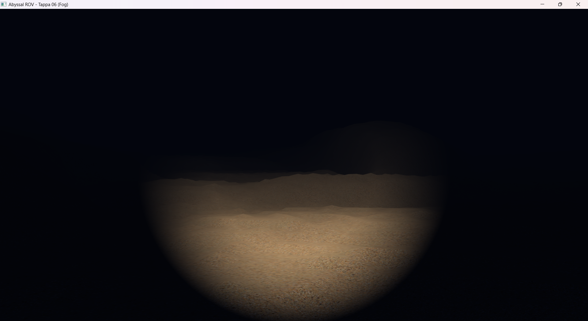

# Tappa 06: Effetto Nebbia Volumetrica (Depth Fog)

## Obiettivo della Tappa e Motivazioni
Per conferire un senso di profondità e consistenza fluida all'ambiente abissale, si è passati dall'oscurità assoluta a un effetto di Nebbia Volumetrica basata sulla distanza. Questo passaggio risolve il problema visivo del "taglio" improvviso della geometria ai confini della mappa e simula la torbidità naturale dell'acqua oceanica.
Nel *Fragment Shader*, è stata implementata una nebbia di tipo "Esponenziale al Quadrato" (*EXP2 Fog*). A differenza della nebbia lineare, che crea uno sfumato innaturale, la formula $f = e^{-(\text{distanza} \cdot \text{densità})^2}$ mantiene la chiarezza visiva in prossimità della telecamera, decadendo in modo brusco ma realistico sulle medie-lunghe distanze.
Il risultato finale del pixel è un'interpolazione lineare (tramite `mix()`) tra il colore calcolato del frammento illuminato e il colore base della nebbia, pesato dal fattore di *Fog* appena calcolato.

## Istruzioni di Build
1. Aggiungere il target `Tappa06` al file `CMakeLists.txt`.
2. Compilare il progetto: `cmake --build build`.
3. Eseguire l'applicazione (es. `./build/Tappa06.exe`).

## Comandi del Giocatore
* **W / S:** Avanza / Indietreggia.
* **A / D:** Traslazione laterale.
* **Spazio / Shift Sinistro:** Emersione / Immersione.
* **Mouse:** Rotazione a 360 gradi.
* **ESC:** Uscita.
* **TAB:** Sblocco del mouse. Il cursore viene liberato e la telecamera viene messa in "pausa", permettendo di uscire dai confini della finestra per ridimensionarla o chiuderla tramite OS.

## Problematiche Affrontate e Soluzioni

* **Problema 1:** In fase di tuning, il cono di luce faticava a "bucare" la nebbia, o viceversa l'ambiente risultava troppo limpido annullando l'effetto abissale. Aumentare la potenza dello *Spotlight* portava a sovraesposizione (bruciando la texture).
    * **Soluzione:** Ho mantenuto intatto il setup fotometrico dei fari della Tappa 05. Ho agito esclusivamente sul parametro `fogDensity` nel Fragment Shader, trovando il punto di equilibrio ideale a `0.028`. Questo valore garantisce la piena leggibilità del fondale illuminato a corto raggio, dissolvendo i picchi rocciosi in lontananza.
* **Problema 2:** Nonostante l'applicazione della nebbia sul terreno, la transizione tra il punto in cui finiva la *heightmap* e lo sfondo della finestra risultava netto e irrealistico.
    * **Soluzione:** Ho applicato una delle regole importanti del *Fog Rendering*: il colore della nebbia all'interno dello Shader (`vec3(0.01, 0.02, 0.05)`) deve essere identico e allineato matematicamente al colore di pulizia del Color Buffer nel C++ (`glClearColor(0.01f, 0.02f, 0.05f, 1.0f)`). In questo modo, l'orizzonte si fonde perfettamente con lo sfondo senza stacchi visibili.
* **Problema 3:** Per calcolare quanto un frammento debba essere "annebbiato", lo Shader deve conoscere la sua distanza esatta dall'osservatore.
    * **Soluzione:** Ho aggiunto una nuova *Uniform* al Fragment Shader chiamata `viewPos` (che riceve `camera.Position` dal C++). Questo permette di calcolare la distanza vettoriale esatta (`length(viewPos - FragPos)`) per ogni singolo pixel prima di applicare la formula esponenziale.
* **Problema 4:** La formula matematica dell'esponenziale inverso tende asintoticamente a zero, ma piccoli errori di *floating point* potevano generare artefatti o valori negativi, rompendo la funzione `mix()`.
    * **Soluzione:** Ho applicato rigorosamente un `clamp(fogFactor, 0.0, 1.0)` per assicurarmi che il fattore di mescolamento rimanesse sempre strettamente all'interno dei confini fisicamente possibili, prima della generazione del colore finale.

## Utilizzo IA
L'implementazione del modello di illuminazione base (Lambert/Phong) è stata scritta seguendo i concetti teorici del corso. Tuttavia, strumenti di Intelligenza Artificiale Generativa (LLM) sono stati impiegati in fase di *pair-programming* per le implementazioni matematiche più avanzate: nello specifico, l'interpolazione fluida per l'attenuazione dei bordi del faro sottomarino (Spotlight soft-edges tramite `clamp` ed `epsilon`) e la formulazione matematica della Nebbia Volumetrica Esponenziale (`EXP2`) all'interno del Fragment Shader.

## Screenshot della Tappa
