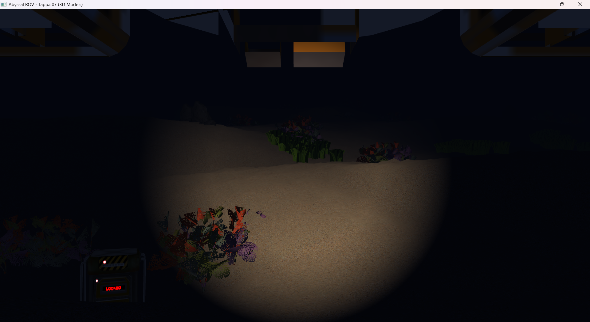

# Tappa 07: Modelli 3D, Materiali Emissivi e Collisioni

## Obiettivo della Tappa e Motivazioni
Questa tappa trasforma l'ambiente da una semplice heightmap vuota a un ecosistema sottomarino esplorabile, introducendo la gestione di modelli 3D esterni, materiali complessi e logica fisica di base.
Gli obiettivi principali sono due:
1. **Grafica (Modelli e Materiali):** Importazione di mesh 3D (ROV, sonde, rocce, coralli, alghe) e gestione delle rispettive texture. È stato aggiornato il *Fragment Shader* per calcolare la luce diffusa basandosi sulle normali delle facce metalliche e per supportare le *Emissive Maps*, permettendo ai container di "brillare" di luce propria nel buio.
2. **Fisica (Collisioni):** Implementazione di una logica di *Clipping* per impedire alla telecamera di compenetrare il fondale roccioso (leggendo l'altezza della heightmap a runtime) e creazione di un sistema di *Hitbox* sferiche per la raccolta delle sonde sparse per la mappa.

* **Crediti Strumenti e Risorse:** I modelli 3D utilizzati per l'ambiente e il sottomarino sono stati scaricati gratuitamente dal database **Sketchfab** (https://sketchfab.com). Per l'ispezione, il centraggio dei pivot e la triangolazione delle mesh è stato utilizzato il software open-source **Blender**.

## Istruzioni di Build
1. Assicurarsi che i file `.obj` e le relative texture siano presenti in `Cartella-risorse/`.
2. Verificare la presenza del nuovo parser `ModelLoader.h` nella `Cartella-Tappa07`.
3. Aggiungere il target `Tappa07` al file `CMakeLists.txt`.
4. Compilare il progetto: `cmake --build build`.
5. Avviare l'eseguibile risultante.

## Comandi del Giocatore
* **W / S:** Avanza / Indietreggia.
* **A / D:** Traslazione laterale.
* **Spazio / Shift Sinistro:** Emersione / Immersione.
* **Mouse:** Rotazione della telecamera.
* **ESC:** Uscita.
* **TAB:** Sblocco del mouse. Il cursore viene liberato e la telecamera viene messa in "pausa", permettendo di uscire dai confini della finestra per ridimensionarla o chiuderla tramite OS.

## Problematiche Affrontate e Soluzioni

* **Problema 1:** Per evitare dipendenze esterne pesanti da scaricare e configurare (come la libreria *Assimp*), era necessario un modo nativo per estrarre la geometria 3D direttamente dai file testuali.
    * **Soluzione:** Invece di investire tempo nella scrittura di un complesso parser di stringhe in C++, ho adottato un approccio pragmatico delegando la stesura della classe custom `ModelLoader.h` a uno strumento di IA (vedi dichiarazione in basso). Il codice risultante utilizza `<fstream>` per analizzare i file `.obj` riga per riga, estraendo vertici (`v`), coordinate UV (`vt`) e normali (`vn`), assemblandoli in un singolo array lineare pronto per i buffer di OpenGL.
* **Problema 2:** I modelli gratuiti (da Sketchfab) presentavano spesso pivot decentrati o texture ottimizzate per il PBR (Physically Based Rendering), troppo complesse per un classico shader Phong.
    * **Soluzione:** I modelli sono stati normalizzati tramite Blender (centraggio e spunta su *Triangulate Mesh* all'esportazione). Per l'illuminazione, sono state estratte e utilizzate solo le texture *Base Color* e, nel caso dei container, la mappa *Emissive*, che è stata sommata a fine shader per eludere l'oscurità ambientale e far "brillare" la scritta.
* **Problema 3:** Posizionare gli oggetti a un'altezza Y fissa li faceva fluttuare o scomparire sotto la heightmap irregolare.
    * **Soluzione:** Ho scritto la funzione `getTerrainHeight` che calcola l'altitudine del terreno in uno specifico punto (X, Z). Le sonde sono state traslate a `terrainY - 0.4f` per affossarle leggermente e credibilmente nella sabbia.
* **Problema 4:** L'applicazione del calcolo della luce basato sulle Normali scuriva in modo errato il fondale di sabbia (progettato per non usarle in questa fase).
    * **Soluzione:** Ho inserito l'uniform booleano `useNormals` negli Shader. Questo agisce come un interruttore: calcola l'illuminazione complessa e alza la luce ambientale (`vec3(0.08, 0.10, 0.15)`) sui modelli importati, disattivandola sul fondale procedurale.
* **Problema 5:** Generare le sonde in posizioni casuali rischiava di raggrupparle troppo al centro della mappa.
    * **Soluzione:** L'array `containerPositions` è stato hard-codato spingendo le coordinate X e Z vicino ai limiti calcolati della griglia spaziale (circa -128.0f e +128.0f), favorendo l'esplorazione a lungo raggio.
* **Problema 6:** Il modello del sottomarino (agganciato a `camera.Position`) rischiava di coprire interamente la visuale con l'interno nero dello scafo o di non ruotare coerentemente con la telecamera.
    * **Soluzione:** Ho costruito dinamicamente una matrice di rotazione basata sui vettori locali della telecamera (`Front`, `Up`, `Right`). La mesh è stata lasciata in scala 1:1, ma traslata con un offset in basso e in avanti (`0.0f, 1.0f, -0.2f`), creando un effetto "visore" in cui si scorgono solo la carrozzeria inferiore e i fari superiori.
* **Problema 7:** La navigazione non aveva limiti, rischiando di far uscire il ROV dai confini della heightmap o rendendo i container impossibili da raccogliere.
    * **Soluzione:** Ho implementato un blocco matematico (`mapLimit = 115.0f`) che impedisce alle coordinate della telecamera di sforare il fondale generato. Il raggio della sfera di collisione per raccogliere le sonde è stato settato e testato a `collectionRadius = 2.0f`.
* **Problema 8:** I modelli dei coralli, composti da *cards* (piani 2D incrociati), mostravano bordi neri, erano "sdraiati" e presentavano colori sballati.
    * **Soluzione:** L'orientamento è stato corretto ruotando la mesh di `-90` gradi sull'asse X. L'inversione UV (`flipVertically()`) è stata rimossa per allineare correttamente la texture. Infine, per scartare i frammenti trasparenti della geometria senza ricorrere al Blending, è stato inserito un *Alpha Discard* nello shader (`if (texColor.a < 0.1) discard;`).

## Utilizzo IA
Nello sviluppo di questa tappa, strumenti di Intelligenza Artificiale Generativa (LLM) sono stati impiegati in fase di *pair-programming*. Nello specifico, l'ingegnerizzazione e la scrittura del file `ModelLoader.h` (il parser testuale dedicato all'estrazione dei dati dai file Wavefront `.obj` per vertici, normali e coordinate UV) è stata delegata integralmente allo strumento di IA, permettendomi così di concentrarmi esclusivamente sull'architettura grafica di OpenGL e sulla gestione dei buffer.

## Screenshot della Tappa
