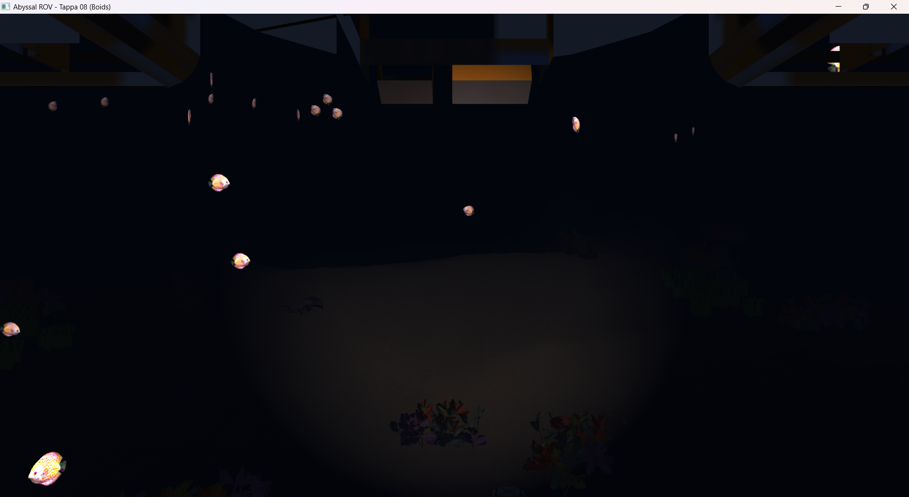

# Tappa 08: Comportamento Emergente (Algoritmo Boids su CPU)

## Obiettivo della Tappa e Motivazioni
L'obiettivo di questa tappa è animare l'ambiente oceanico introducendo una fauna interattiva, senza ricorrere ad animazioni predeterminate (*keyframing*). Ho implementato un sistema multi-agente basato sul celebre algoritmo *Boids* di Craig Reynolds, calcolato interamente sulla CPU.
Una nuova struttura dati `Boid` traccia Posizione, Velocità e Accelerazione per 150 esemplari di pesci. Ad ogni frame, l'algoritmo calcola e bilancia tre vettori direzionali per ogni entità:
1. **Separazione:** Repulsione locale per evitare l'intersezione tra le mesh.
2. **Allineamento:** Adeguamento della velocità per assecondare la media del gruppo.
3. **Coesione:** Attrazione verso il centro di massa locale per formare banchi compatti.
A questi è stata aggiunta una logica di *Gameplay*: una forza di repulsione esterna che si innesca quando il ROV si avvicina puntando il faro verso il banco, costringendo i Boids a virare bruscamente.
In attesa di ottimizzare le Draw Calls, il rendering avviene in un ciclo `for` convenzionale, applicando dinamicamente una matrice di rotazione (Cross Product) per allineare il muso del modello 3D al suo vettore velocità corrente.

* **Crediti Modelli:** Il modello 3D del pesce è stato prelevato da **Sketchfab**, importato in **Blender** per il centraggio dell'origine e l'esportazione triangolata, ed è stato renderizzato forzando il materiale Emissivo (sovraccaricando i canali texture) per simulare bioluminescenza naturale.

## Istruzioni di Build
1. Inserire il file `pesce.obj` e `pesce_texture.png` in `Cartella-risorse/`.
2. Aggiungere il target `Tappa08` al file `CMakeLists.txt`.
3. Compilare il progetto tramite `cmake --build build`.
4. Avviare l'applicazione (es. `./build/Tappa08.exe`).

## Comandi del Giocatore
* **W / S:** Avanza / Indietreggia.
* **A / D:** Traslazione laterale.
* **Spazio / Shift Sinistro:** Emersione / Immersione.
* **Mouse:** Rotazione della telecamera.
* **ESC:** Uscita.
* **TAB:** Sblocco del mouse. Il cursore viene liberato e la telecamera viene messa in "pausa", permettendo di uscire dai confini della finestra per ridimensionarla o chiuderla tramite OS.

## Problematiche Affrontate e Soluzioni

* **Problema 1:** Nei primi test, i pesci si compenetravano formando un'unica "palla" densa, rendendo impossibile distinguere i singoli esemplari.
    * **Soluzione:** Ho eseguito un *tuning* dei coefficienti moltiplicatori di Reynolds. Aumentando drasticamente la Forza di Separazione (`3.5f`) e smorzando la Coesione (`0.7f`), lo stormo ha assunto una conformazione organica e distribuita. Contestualmente, la scala del modello è stata ridotta a `0.15f` per massimizzare la distanza percepita.
* **Problema 2:** I pesci nuotavano "di fianco" rispetto al vettore velocità calcolato, vanificando la sensazione di fuga. Questo accade frequentemente quando si scaricano asset non standardizzati, dove la parte frontale della mesh non è allineata all'asse Z negativo di OpenGL.
    * **Soluzione:** Ho applicato una rotazione statica di correzione alla Model Matrix. Inizialmente testata a $+90^\circ$ sull'asse Y, si è rivelato necessario correggerla a `-90.0f` per compensare l'esatta origine creata dal modellatore, allineando il muso del pesce alla direzione del moto.
* **Problema 3:** Le forze sommate ad ogni frame (accelerazione) causavano un'esplosione della velocità, facendo schizzare i pesci fuori dal *Frustum* visivo in pochi secondi (errore tipico dell'integrazione di Eulero libera).
    * **Soluzione:** Sfruttando il supporto dell'IA per la fisica vettoriale (vedi dichiarazione in basso), ho inserito una funzione lambda di sicurezza (`limitForce`) che normalizza e taglia i vettori direzionali se superano un `maxForce` predefinito. È stato inoltre applicato un taglio netto sulla `velocity` finale impedendole matematicamente di superare un `maxSpeed` assoluto (3.5f).
* **Problema 4:** Poiché i pesci non calcolano collisioni ray-cast con i bordi invisibili della mappa, tendevano a nuotare indefinitamente lontano nel buio, esaurendo lo stormo.
    * **Soluzione:** Sono stati implementati "repulsori statici" volumetrici ai bordi della scacchiera (`mapLimit`). Se un Boid supera la coordinata limite meno un margine di sicurezza (10 metri), riceve una spinta costante di `+1.0f` verso l'interno dell'asse opposto, costringendolo a curvare per rimanere in scena. Lo stesso principio è stato applicato all'asse Y basandosi sulla `heightmap` per evitare compenetrazioni del fondale.
* **Problema 5:** Inserendo tutti gli asset (900 alghe, coralli, pesci, ecc.), il task manager ha rivelato un utilizzo della GPU al 100%. IL mio hardware (Intel UHD Graphics) faticava a elaborare le luci per migliaia di Draw Calls individuali.
    * **Soluzione:** Ho abilitato la sincronizzazione verticale nativa `window.setVerticalSyncEnabled(true);` per bloccare la renderizzazione ai 60Hz del monitor, evitando cicli liberi. L'elevato carico hardware al 100% su una scheda integrata per un ambiente con 1400+ modelli completi di illuminazione Phong è stato accettato come fisiologico per la tecnologia attuale. La radicale ottimizzazione lato CPU-GPU avverrà nella Tappa 09 abbattendo le Draw Calls da ~1400 a 10.

## Utilizzo IA
Essendo la simulazione comportamentale un argomento esterno al programma del corso, strumenti di Intelligenza Artificiale Generativa (LLM) sono stati impiegati come supporto matematico. L'IA è stata fondamentale per la stesura e il bilanciamento della complessa trigonometria e fisica vettoriale alla base dell'algoritmo *Boids* (in particolare per il calcolo delle forze di Separazione, Allineamento, Coesione e per la logica di fuga dal sottomarino).

## Screenshot della Tappa
