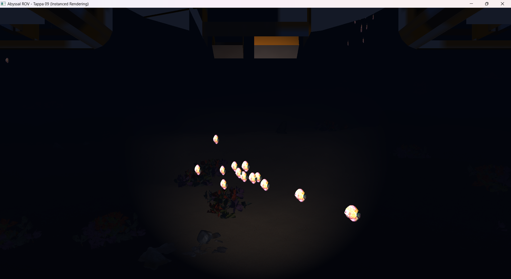

# Tappa 09: Instanced Rendering (GPU)

## Obiettivo della Tappa
L'obiettivo di questa tappa è risolvere il problema del sovraccarico della CPU (CPU Bound) causato dall'enorme numero di chiamate di disegno (Draw Calls). Invece di far comunicare la CPU e la GPU singolarmente per ogni oggetto (pesci, rocce, alghe, coralli), ho implementato l'**Instanced Rendering**. Questo paradigma permette di caricare il modello 3D nella memoria video una sola volta e di istruirla a disegnarlo centinaia di volte simultaneamente, passando un array contenente le matrici di trasformazione di ogni singola istanza.

Questo salto architetturale fa crollare le Draw Calls da oltre 1.400 a meno di 10, liberando la CPU e ottimizzando radicalmente il motore grafico.

## Istruzioni di Build
1. Aggiungere il target `Tappa09` al file `CMakeLists.txt`.
2. Compilare il progetto: `cmake --build build`.
3. Eseguire l'applicazione (es. `./build/Tappa09.exe`).

## Comandi del Giocatore
* **W / S:** Avanza / Indietreggia.
* **A / D:** Traslazione laterale.
* **Spazio / Shift Sinistro:** Emersione / Immersione.
* **Mouse:** Rotazione della telecamera.
* **ESC:** Uscita.
* **TAB:** Sblocco del mouse. Il cursore viene liberato e la telecamera viene messa in "pausa", permettendo di uscire dai confini della finestra per ridimensionarla o chiuderla tramite OS.

## Implementazioni Tecniche
1. **Shader Dedicato (Vertex Shader Instanced):** Ho scritto un nuovo Vertex Shader che non accetta più una singola variabile `uniform mat4 model`, ma riceve un attributo `layout (location = 3) in mat4 instanceMatrix;`. In questo modo, il calcolo della posizione finale viene effettuato direttamente dai core della GPU in parallelo per ogni istanza.
2. **Static Instancing (Ambiente):** Per rocce, coralli e alghe (oggetti fermi), l'array di matrici viene inviato al VBO (Vertex Buffer Object) una singola volta prima del game loop usando `GL_STATIC_DRAW`.
3. **Dynamic Instancing (Boids/Pesci):** Poiché i pesci si muovono a ogni frame, il loro VBO è configurato con `GL_DYNAMIC_DRAW`. Nel game loop, le matrici vengono ricalcolate e aggiornate in blocco nella memoria video.
4. **Vertex Attrib Divisor:** Utilizzo della funzione `glVertexAttribDivisor` per spiegare a OpenGL che la matrice 4x4 (suddivisa in 4 vettori `vec4`) deve avanzare non per ogni vertice, ma per ogni istanza dell'oggetto.

## Problematiche Affrontate e Soluzioni

* **Problema 1:** Nonostante le Draw Calls fossero ridotte a pochissime unità, il Task Manager segnalava un utilizzo della GPU fisso al 100% a gioco aperto. Inizialmente sospettavo un fallimento del V-Sync (over-rendering) o un problema di Overdraw causato dall'Anti-Aliasing combinato con l'istruzione `discard` sulle 900 alghe.
    * **Soluzione/Compromesso:** Dopo vari test (incluso l'azzeramento dell'Anti-Aliasing), ho concluso che non vi è alcun errore software, ma un **limite fisico dell'hardware**. La scheda video integrata (iGPU) deve calcolare l'illuminazione di Phong, la nebbia EXP2 e scartare i frammenti trasparenti per oltre 1.400 oggetti simultanei. Le GPU sono fisicamente progettate per lavorare al 100% sotto sforzo e, poiché la fluidità è garantita a 60 FPS stabili, ho scelto di accettare questo naturale carico di lavoro.
* **Problema 2:** Durante i primi test, i pesci e le rocce apparivano illuminati in modo anomalo (ad esempio, le ombre non seguivano la rotazione dell'oggetto). Nel Fragment Shader dell'Instancing, la normale veniva calcolata moltiplicandola per una matrice globale (`model`), che però non esisteva più nel nuovo shader, essendo stata sostituita dalle singole matrici individuali.
    * **Soluzione:** Il Vertex Shader Instanced è stato corretto per ricalcolare la Matrice Normale dinamicamente per ogni istanza: `Normal = mat3(transpose(inverse(instanceMatrix))) * aNormal;`.
* **Problema 3:** Aumentando drasticamente il numero di oggetti tramite l'Instancing, sono comparsi fastidiosi sfarfallii grafici (Z-Fighting) causati da rocce o alghe generate esattamente nelle stesse coordinate spaziali. L'algoritmo di distribuzione randomica (`std::rand`) non aveva vincoli spaziali sufficienti tra gli oggetti della stessa tipologia.
    * **Soluzione:** Ho implementato un sistema di controlli incrociati di distanza spaziale (tramite `glm::distance`) all'interno dei cicli `while` di generazione procedurale. Ogni nuovo oggetto calcola la sua distanza dalle sonde e dalle altre rocce grandi; se scende sotto un `safeRadius`, la coordinata viene scartata e ricalcolata.
* **Problema 4:** Inizialmente, l'aggiornamento delle matrici dello stormo di pesci (Dynamic Instancing) avveniva distruggendo e ricreando il buffer a ogni singolo fotogramma tramite `glBufferData`, causando microscatti e appesantendo il bus di sistema.
    * **Soluzione:** Sfruttando i suggerimenti dell'IA per la gestione avanzata della memoria video (vedi dichiarazione in basso), si è separata l'allocazione dall'aggiornamento. Il buffer viene ora pre-allocato vuoto con flag `GL_DYNAMIC_DRAW` prima del loop (`glBufferData(..., NULL, GL_DYNAMIC_DRAW)`). Durante il gioco, si utilizza esclusivamente la funzione `glBufferSubData` per sovrascrivere precisamente solo il segmento di memoria video necessario, massimizzando l'efficienza del trasferimento.

## Utilizzo IA
Nello sviluppo di questa tappa, strumenti di Intelligenza Artificiale Generativa (LLM) sono stati impiegati in fase di *pair-programming* e *debugging*. Essendo l'Instanced Rendering una tecnica avanzata, l'IA ha supportato la risoluzione dei conflitti di memoria video, suggerendo la corretta configurazione dei layout e delle istruzioni OpenGL specifiche (`glVertexAttribDivisor` e `glBufferSubData`) per evitare colli di bottiglia nel trasferimento dati tra CPU e GPU.

# Screenshot della Tappa

*Gif 1: Il risultato visivo della Tappa 09 è volutamente identico a quello della Tappa 08. L'intero lavoro di questa fase è avvenuto "sotto il cofano", ristrutturando la pipeline grafica per renderizzare la stessa identica scena abbattendo le Draw Calls da oltre 1.400 a meno di 10.*