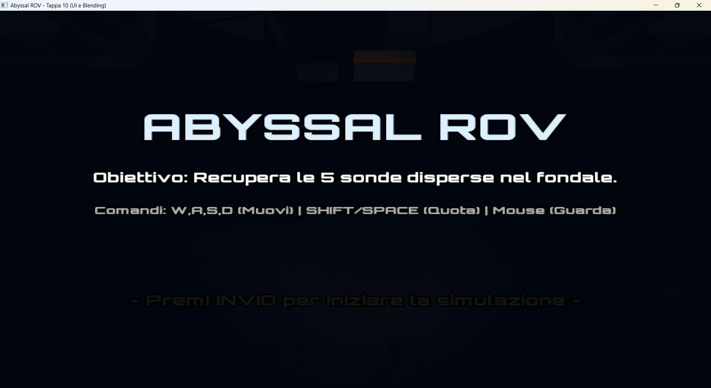
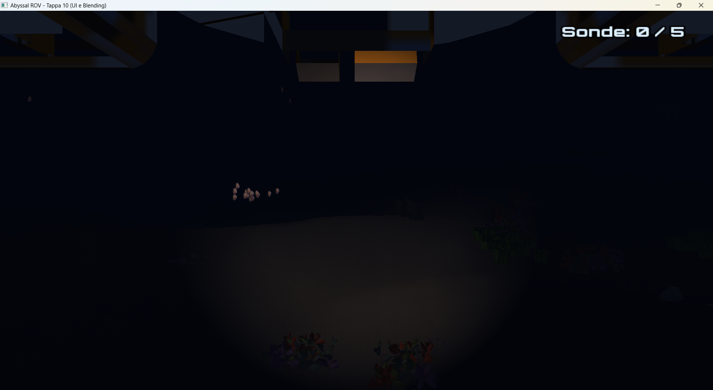
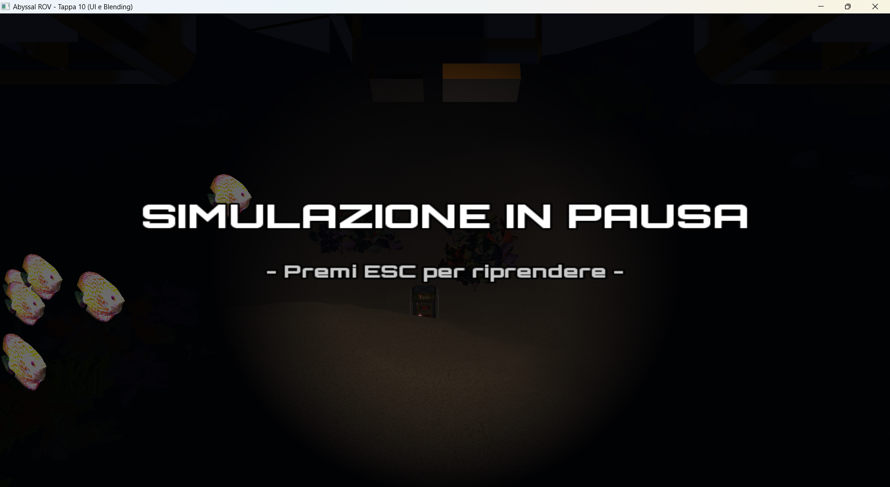
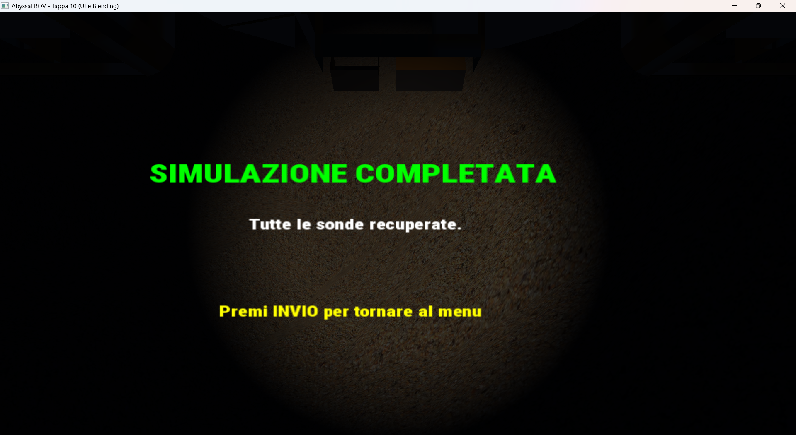

# Tappa 10: UI, Macchina a Stati e Alpha Blending

## Obiettivo della Tappa
L'obiettivo finale del progetto è trasformare un motore grafico puramente visivo in un'esperienza interattiva completa. In questa tappa è stata implementata l'Interfaccia Utente (UI) bidimensionale in sovraimpressione al mondo 3D, gestita tramite una **Macchina a Stati** per controllare il flusso logico del programma (Menu, Gameplay, Pausa, Fine Gioco). 
Si è inoltre posta grande attenzione al *Game Design* e allo *Scoping*, ottimizzando il ciclo di gioco per garantire un'esperienza fluida e priva di memory leaks all'interno di una singola architettura C++.

## Istruzioni di Build
1. Aggiungere il target `Tappa10` al file `CMakeLists.txt`.
2. Compilare il progetto eseguendo da terminale: `cmake --build build`.
3. Eseguire l'applicazione (es. `./build/Tappa10.exe`).

## Comandi e Gestione Finestra
* **INVIO:** Avvia la simulazione dal Menu Principale o riavvia la partita dalla schermata di Game Over.
* **W / S:** Avanza / Indietreggia.
* **A / D:** Traslazione laterale.
* **Spazio / Shift Sinistro:** Emersione / Immersione.
* **Mouse:** Rotazione della telecamera a 360 gradi (attiva esclusivamente nello stato PLAYING).
* **ESC:** Durante il gioco mette in Pausa la simulazione (Active Pause) e libera il cursore. Se premuto dal Menu Principale, chiude l'applicazione.
* **Gestione Cursore (Automatica):** Il mouse viene sbloccato in automatico in tutti gli stati di inattività (MENU, PAUSED, GAMEOVER), permettendo all'utente di uscire dai confini della finestra per ridimensionarla o chiuderla tramite i controlli nativi del sistema operativo.

## Implementazioni Tecniche
1. **Macchina a Stati (State Machine):** Il flusso del programma è ora governato da un `enum GameState { MENU, PLAYING, PAUSED, GAMEOVER }`. Questo permette di isolare la logica: ad esempio, il calcolo delle collisioni del sottomarino avviene *solo* nello stato `PLAYING`.
2. **Active Pause (Pausa Attiva):** Invece di "congelare" brutalmente il loop di gioco bloccando la fisica (Boids) e il rendering, lo stato `PAUSED` disabilita unicamente l'input del giocatore. Questo crea un effetto molto cinematografico: il menu in semitrasparenza appare a schermo mentre la simulazione marina continua a scorrere fluidamente sul fondo.
3. **HUD Minimalista e UI Design:** Per preservare l'immersività nell'abisso, l'HUD in gioco è stato ridotto al minimo indispensabile (un contatore dinamico delle sonde). È stato utilizzato il font *Orbitron*, applicando dinamicamente un *Outline* (bordo nero) tramite le funzioni native di SFML per garantire la leggibilità su qualsiasi colore di sfondo.
4. **Reset Istantaneo (Lambda Function):** È stata creata la funzione lambda `resetGame()` che, invece di ricaricare asset o riavviare il programma, ripristina istantaneamente le coordinate iniziali del sottomarino e ripopola l'array dei container, garantendo una transizione fluida da `GAMEOVER` a `PLAYING`.

## Problemi Riscontrati e Soluzioni

### Problema 1: 
Appena inserito il codice per l'interfaccia 2D di SFML, il terminale ha iniziato a generare un loop infinito di errori OpenGL, bloccando la scheda video (nonostante il gioco fosse perfettamente funzionante).
* **Causa:** Il progetto era configurato con il profilo OpenGL `Core`, che vieta rigorosamente i comandi "legacy". Tuttavia, le funzioni di disegno 2D native di SFML (`window.draw()`) utilizzano sotto il cofano proprio quelle istruzioni (come `glMatrixMode` o `glVertexPointer`).
* **Soluzione:** Ho modificato il profilo della finestra in `sf::ContextSettings::Default` (Compatibility Profile). Inoltre, per evitare che lo stato del 3D inquinasse il 2D, ho creato una "zona di isolamento": prima di chiamare il 2D si azzerano gli stati (`glUseProgram(0)`, `glBindVertexArray(0)`) e il disegno SFML viene avvolto tra i comandi `window.pushGLStates()` e `window.popGLStates()`.

### Problema 2: 
L'implementazione dei testi centratura dell'HUD generava errori di compilazione non documentati nei vecchi tutorial di SFML.
* **Causa:** L'utilizzo della versione SFML 3.0 ha introdotto *breaking changes* nell'API. Variabili come `.left`, `.top`, `.width` e `.height` non esistono più, sostituite dai vettori `.position` e `.size`.
* **Soluzione:** Ho riscritto il codice della UI utilizzando l'inizializzazione uniforme con parentesi graffe `{x, y}` per funzioni come `setPosition` e `setOrigin`.

### Problema 3:
Posizionando inizialmente l'HUD in alto a sinistra, il testo bianco diventava totalmente illeggibile quando il sottomarino inquadrava zone illuminate o la sabbia chiara.
* **Soluzione:** L'HUD è stato spostato in alto a destra (dove l'acqua è tendenzialmente più buia per assenza di elementi ambientali ravvicinate). Inoltre, l'utilizzo di `setOutlineThickness(2.0f)` nero ha reso il testo leggibile al 100% indipendentemente dalla luminosità dello sfondo 3D.

### Problema 4: 
Durante i primi test di sovrapposizione tra 3D e 2D, parti del testo del menu venivano "tagliate" o scomparivano misteriosamente quando il sottomarino si avvicinava alle pareti dei dislivelli.
Il *Depth Test* (Z-Buffer) di OpenGL era rimasto attivo. Quando SFML disegnava i pixel del testo in 2D, OpenGL confrontava la loro profondità con quella delle rocce 3D. Se una roccia risultava più "vicina" allo schermo rispetto al piano 2D astratto, OpenGL scartava i pixel della scritta.
* **Soluzione:** Ho aggiunto il comando `glDisable(GL_DEPTH_TEST)` immediatamente prima del blocco di rendering della UI, per dire alla GPU di "stampare" l'interfaccia sopra a tutto, ignorando la profondità. Al termine del 2D, utilizzo `glEnable(GL_DEPTH_TEST)` per ripristinare il corretto rendering 3D al frame successivo.

### Problema 5: Scoping, Tagli e Prevenzione dei Memory Leak
Inizialmente per la Tappa 10 era prevista l'implementazione di un sistema particellare in 2D (bolle) tramite Alpha Blending e di un punto di estrazione volumetrico.
* **Soluzione:** Ho scelto di tagliare queste feature. Aggiungere nuovi buffer particellari alla fine dello sviluppo avrebbe rischiato di destabilizzare l'architettura attuale, che si presenta estremamente coesa, stabile a 60 FPS e priva di *memory leaks*. 

## Screenshot

*Figura 1: Lo stato MENU. La simulazione 3D fa da sfondo interattivo all'interfaccia 2D disegnata con SFML.*

*Figura 2: Lo stato PLAYING con HUD posizionato in alto a destra e testo in contrasto.*

*Figura 3: Lo stato PAUSED (come nello stato MENU l'interfaccia 3D non viene bloccata).*

*Figura 4: Lo stato GAMEOVER (quando sono stati recuperati tutti i 5 container).*